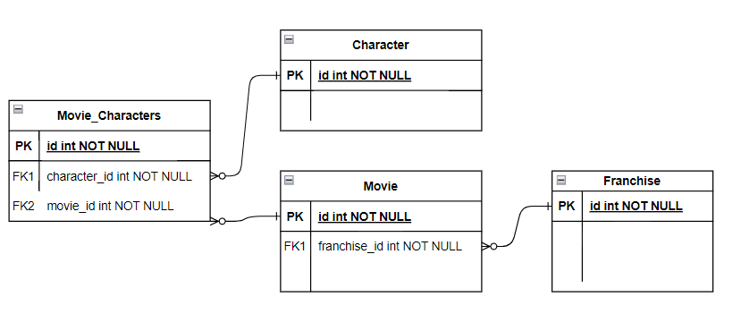

# Noroff Assignment 3 - Access and expose a database
3rd assignment in the Noroff accelerate program focusing on building a database and accessing it using a REST Web API.

## Built With
#### Java, Spring Boot & Spring Data JPA
Programming language and Framework used to create the Web API and run it. Spring Data JPA is used to create JPA standard repositories that act as the main interface between
the API and the Database. Additionally, MapStruct is used as a code generator for abstract mapping-beans and Lombok is used for simplification of Getter-Setter logic.
#### PostgreSQL & Hibernate
The Database provider is PostgreSQL and Hibernate is used together with Spring in the application to manage initialization, management and general communication with the Database.
#### OpenAPI (Swagger)
Used for automatic, generative documentation of the REST API and as the main way of accessing and interacting with the API and its endpoints.

## Architecture
#### Domain model
The project contains a Database and a Web API that models and caters for general CRUD operations and some extended modification capabilities towards 
a simple environment comprised of the domain entities Movie, Franchise and Character. The relationships between these entities in the database can be viewed in the database
model below:



#### Web API
The API is built in a REST-ful manner utilizing REST controllers and a seperation of responsibilities across multiple layers to create less complexity. The API layers are [Repository(Data access) -> Service(Business logic) -> Controller (Endpoints)].
It utilizes Data Transfer Objects when transfering any data to and from a potential Client to ensure no information about the internal
application or database configurations are needlessly exposed. Switching between Database/Spring entities and these DTO's are achieved using mappers generated by MapStruct.

## Running
To run the Web API locally on your machine without considering docker you must carry out the following steps:

* Clone repository
* Create a PostgreSQL database instance
* Change these credentials in **resources/application.properties** to match your own PostgreSQL user and instance
  ```sh
  MYSQL_ADDRESS = 127.0.0.1:5432/$YOUR_DATABASE$
  MYSQL_PASSWORD = $YOUR_PASSWORD$
  spring.datasource.username = $YOUR_USERNAME$
  ```
* Go to the following address in your browser of choice to interact with the API using OpenAPI (Swagger)
  ```sh
  http://localhost:8080/swagger-ui.html
  ```


